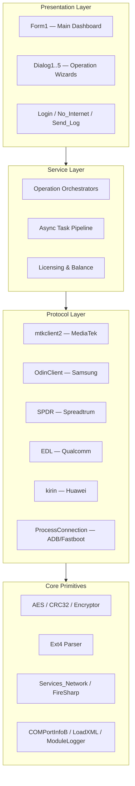

# Tunlocker Tool Pro — Open-Source Android Service Tool (WinForms / .NET)

**A complete, readable reference implementation of a multi-brand Android service & firmware tool for Windows — built with C# / WinForms on .NET Framework 4.7.2.**


> **TL;DR** — This repository is a deep dive into how professional Android service tools are engineered: low-level USB protocols (MediaTek BROM / preloader, Samsung Odin, Spreadtrum, Qualcomm EDL, Huawei Kirin), ADB / Fastboot automation, partition parsing, Ext4 filesystem operations, AES signing, and a credit-based licensing backend. If you want to learn how to build tools like this, this is the place to start.

---

## ⚠️ Legal Disclaimer (Read First)

This project is published **for educational and research purposes only**. It exists so that developers, security researchers, and repair technicians can study how device-service software works under the hood.

- ✅ **Permitted use:** your own devices, devices you are legally authorized to service, or research in a controlled environment.
- ❌ **Prohibited use:** unlocking, flashing, or modifying devices you do not own or lack authorization for, bypassing theft protection (FRP) on stolen property, or any activity that violates local law or device manufacturer terms.
- 🔗 **Attribution:** *Tunlocker Tool Pro* is © Tfast Digital Agency — https://tfastdigital.com/. All trademarks belong to their respective owners. If you own rights to any included code and want it removed, open an issue.

**By using or building this software you accept full responsibility for your actions.**

---

## 📑 Table of Contents

1. [What Is This Project?](#-what-is-this-project)
2. [Official Links & Community](#-official-links--community)
3. [Download (Ready-to-Run EXE)](#-download-ready-to-run-exe)
4. [Login & Accounts](#-login--accounts)
5. [Features](#-features)
6. [Supported Chipsets & Brands](#-supported-chipsets--brands)
7. [Architecture Overview](#-architecture-overview)
8. [Project Structure](#-project-structure)
9. [Getting Started (Build & Run)](#-getting-started-build--run)
10. [Packaging & Releases](#-packaging--releases)
11. [Backend & API Guide](#-backend--api-guide)
12. [How to Learn from This Codebase](#-how-to-learn-from-this-codebase)
13. [Learning Resources](#-learning-resources)
14. [Roadmap](#-roadmap)
15. [Contributing](#-contributing)
16. [Credits & Attribution](#-credits--attribution)
17. [License](#-license)

---

## 🔍 What Is This Project?

**Tunlocker Tool Pro** is a Windows desktop application in the same family as MTK Auth Bypass, SP Flash Tool, and Odin. It communicates directly with Android devices over USB at the *protocol level* — no Android app is required — to perform service operations such as:

- Reading/writing device partitions and firmware images,
- Removing Factory Reset Protection (FRP) locks,
- Repairing IMEI and restoring certificate files,
- Flashing firmware (scatter-file based and single-image),
- Switching devices between modes (preloader, BROM, EDL, Fastboot, ADB).

The entire codebase is a **case study in real-world engineering**: raw USB communication, serial-port handling, cryptographic signing, filesystem parsing, async task pipelines, and a multi-layer UI — all in C#.

---

## 🌐 Official Links & Community

Stay connected with **Tfast Digital Agency** — updates, support, and community:

| Channel | Link |
| --- | --- |
| 🌍 Website | [tfastdigital.com](https://tfastdigital.com/) |
| ✈️ Telegram | [t.me/tfasthub](https://t.me/tfasthub) |
| ▶️ YouTube | [@TfastDigital](https://www.youtube.com/@TfastDigital) |
| 🎵 TikTok | [@tfasthub](https://www.tiktok.com/@tfasthub) |
| 💬 WhatsApp | [+256 751 399 620](https://wa.me/256751399620) |

---

## ⬇️ Download (Ready-to-Run EXE)

Don't want to build from source? Grab the pre-built portable package from the [Releases](https://github.com/tfastdigital/Tunlocker-Tool-Pro/releases) page:

1. Download **`TunlockerToolPro-v2.0.0-win-x64.zip`**
2. Extract it anywhere — **no installation required**
3. Run `Tunlocker Tool.exe`
4. Log in with your licensed account (see [Login & Accounts](#-login--accounts))

> ⚠️ **Windows Defender / SmartScreen warning:** phone-service tools are commonly flagged as PUP/PUA. If the download or the EXE is blocked, add the extracted folder to Defender exclusions. The file is **not code-signed**.

---

## 🔐 Login & Accounts

The tool is **account-based**: operations are gated by a credit/token license issued by the official server.

**How login works** (implemented in `motoulocked/Login.cs`):

1. Enter your **username (email) + password** on the login screen.
2. The client encrypts the request and POSTs it to `https://api.tfastdigital.com/api/server` → `loginapi/`.
3. The server replies with your license profile: activation state, credit balance, license type (`CREDIT LICENSE` or annual), validity dates, device/function restrictions, and a session token.
4. The client verifies the anti-tamper nonce and unlocks exactly the operations your license allows.

**Where to get an account:**

| Option | Link |
| --- | --- |
| 🌍 Official panel | [panel.tfastdigital.com](https://panel.tfastdigital.com/OperationTools/Index) |
| ✈️ Telegram | [t.me/tfasthub](https://t.me/tfasthub) |
| 💬 WhatsApp | [+256 751 399 620](https://wa.me/256751399620) |

> ℹ️ There is **no built-in demo account** in the source — licenses are issued by Tfast Digital Agency. Developers who want full control can deploy their own backend instead (see [Backend & API Guide](#-backend--api-guide)).

---

## ✨ Features

| Category | Details |
| --- | --- |
| 🔌 **Multi-protocol engine** | MediaTek BROM & preloader, Samsung Odin protocol, Spreadtrum/Unisoc (SPDR), Qualcomm EDL (Sahara/Firehose), Huawei Kirin (DIAGNOS), Motorola fastboot flows |
| 📱 **ADB / Fastboot automation** | Bundled `adb.exe` + `fastboot.exe`, process management, mode switching, device info extraction |
| 🧱 **Firmware flashing** | Scatter-file parsing, partition selection (`Select_Prtitoin`), per-partition read/write/erase, CRC32 verification |
| 🔓 **FRP / lock removal** | FRP state detection and removal for supported chipsets |
| 🆔 **IMEI & certificate tools** | IMEI repair helpers, `qcert3` certificate generation, cert save/load (`CertFileSaveGet/Set`) |
| 💾 **Filesystem operations** | Read-only Ext4 parser (`Operations/Ext4`) for pulling data from device partitions |
| 🔐 **Cryptography** | AES encryption/decryption (`AESS.cs`), symbol/string encryption (`SymbolEnc`, `tmpcrpt`), CRC32 hashing (`Force/Crc32`) |
| 🌐 **Licensing backend** | Credit-based API login (`core/apilogin`), balance updates, token auth (`tokdata`), ban management, logging — a realistic client/server tool architecture |
| 🎨 **Modern UI layer** | Guna.UI2 + HZH_Controls themed WinForms, custom tab control, multi-step dialogs, live logging console |
| 🧰 **Utility subsystem** | COM port enumeration, network services, XML config loading, update checker, crash/error reporting |

---

## 📱 Supported Chipsets & Brands

| Brand | Chipset / Protocol | Key Modules |
| --- | --- | --- |
| **Motorola** | Qualcomm + MediaTek (fastboot/ADB flows) | `motoulocked/AndroidCommands.cs`, `Android_Qualcomm.cs` |
| **Samsung** | Exynos & Qualcomm (Odin protocol) | `OdinClient/` |
| **MediaTek (generic)** | MTK BROM / Preloader — C# port of *mtkclient* | `mtkclient2/` (`MTK/`, `Tasks/`, `devicehandler/`, `USBFastConnect.cs`) |
| **Spreadtrum / Unisoc** | SPD ResearchDownload / PAC flashing | `SPD/`, `SPDR.cs` |
| **Huawei / Honor** | HiSilicon Kirin (DIAGNOS) | `HuaweiUnlocker/`, `kirin.cs` |
| **Qualcomm (generic)** | EDL / Sahara / Firehose | `EDL.cs` |

---

## 🏗️ Architecture Overview

The application is split into clean layers — a great example of how large tools stay maintainable:



- **Protocol Layer** — speaks chipset dialects over raw USB endpoints / serial ports. The MediaTek stack is a faithful C# port of the open-source `mtkclient` project (`MtkTask.InitAsync`, `Unlock_Code_1/2`).
- **Core Primitives** — reusable, chipset-agnostic building blocks: crypto, hashing, filesystem access, networking, logging.
- **Service Layer** — coordinates multi-step operations, reports progress, and enforces the credit/token model against the remote API.
- **UI Layer** — Guna.UI2-themed WinForms with wizard dialogs; the main form drives operations asynchronously without freezing the UI.

---

## 📂 Project Structure

```
Tunlocker-Tool-Pro/
├── Tunlocker Tool.sln / .csproj     # SDK-style project, net472, WinForms (AnyCPU)
├── motoulocked/                     # main application code
│   ├── Form1.cs                     # main dashboard (~34k lines — orchestration hub)
│   ├── AndroidCommands.cs           # generic Android device commands
│   ├── Android_Qualcomm.cs          # Qualcomm-specific fastboot/EDL helpers
│   ├── Protocol_MTK_By_Devronix.cs  # MediaTek protocol (legacy path)
│   ├── ProcessConnection.cs         # ADB/Fastboot process control
│   ├── EDL.cs, flash.cs, FRP.cs     # EDL, flashing, FRP operations
│   ├── kirin.cs, SPDR.cs            # Huawei & Spreadtrum flows
│   ├── AESS.cs, encryptor.cs        # AES + general encryption
│   ├── SymbolEnc.cs, tmpcrpt.cs     # string/symbol obfuscation helpers
│   ├── qcert3.cs, Cert.cs           # certificate / IMEI tooling
│   ├── COMPortInfoB.cs              # COM port discovery
│   ├── Services_Network.cs          # HTTP/network services (FireSharp/Firebase)
│   ├── Login.cs, No_Internet.cs     # auth + connectivity screens
│   ├── banuser.cs, Balancepdate.cs  # licensing backend calls
│   ├── LoadXML.cs, toolparam.cs     # config + parameter management
│   └── ModuleLogger.cs, Send_Log.cs # logging & telemetry
│
├── motoulocked/
│   ├── core/                        # API client models (apilogin, tokdata, GetInfoSend…)
│   ├── Controls/                    # custom UI controls (TabControlExt)
│   ├── Force/Crc32/                 # CRC32 implementation
│   ├── HuaweiUnlocker/              # DIAGNOS + TOOLS for Kirin
│   ├── HZH_Controls/                # open-source WinForms UI library (adapted)
│   ├── mtkclient2/                  # C# port of mtkclient
│   │   ├── MTK/                     #   BROM/preloader protocol
│   │   ├── Tasks/                   #   high-level operations
│   │   ├── library/                 #   protocol primitives
│   │   └── devicehandler/           #   device state machines
│   ├── My/, MyUI/                   # UI helpers
│   ├── OdinClient/                  # Samsung Odin protocol implementation
│   ├── Operations/Ext4/             # Ext4 filesystem parser
│   └── SPD/                         # Spreadtrum protocol
│
├── Properties/                      # assembly info, resources
├── Res/                             # native/third-party DLLs (Guna.UI2, FireSharp,
│                                    #   libcurl, libeay32), icons
└── app.manifest                     # Windows application manifest
```

---

## 🚀 Getting Started (Build & Run)

### Prerequisites

| Requirement | Version / Notes |
| --- | --- |
| .NET SDK | 8.0+ (tested with 10.0.301) — the project targets **net472** but builds with the SDK |
| Windows | 10/11 x64 |
| Drivers | Official USB drivers for the chipsets you intend to work with (MTK, Qualcomm, SPD, etc.) |

> 💡 Building a **net472** WinForms project with the modern .NET SDK works out of the box thanks to SDK-style project files.

### Build

```bash
git clone https://github.com/tfastdigital/Tunlocker-Tool-Pro.git
cd "Tunlocker-Tool-Pro"
dotnet build "Tunlocker Tool.sln" -c Debug
```

Output: `bin\Debug\net472\Tunlocker Tool.exe`

Or open `Tunlocker Tool.sln` in **Visual Studio 2022** and press `F5`.

### Known Build Notes

- The build emits a large number of warnings — this is normal for this codebase; there are **0 errors**.
- **Windows Defender may flag the output as a PUP** (phone-service tools are commonly false-positived). Add a folder exclusion for your `bin\` directory if you need to run it.
- The project is **not code-signed**. Run at your own discretion.

---

## 📦 Packaging & Releases

The repository ships with packaging support out of the box — two flavors:

### 1. NuGet Package (GitHub Packages)

The project file carries full NuGet metadata (`PackageId`, `Version`, `PackageTags`, `PackageReadmeFile`…). Build it locally with:

```bash
dotnet pack "Tunlocker Tool.csproj" -c Release -o packages
```

This produces `packages/TunlockerToolPro.2.0.0.nupkg`.

### 2. Ready-to-run Release ZIP (GitHub Actions)

The included workflow [`.github/workflows/build-and-package.yml`](.github/workflows/build-and-package.yml) automates the whole pipeline:

| Trigger | What happens |
| --- | --- |
| `push` / `pull_request` | Builds `Release`, stages a runnable folder, uploads it as a workflow artifact |
| Tag push (e.g. `v2.0.0`) | Additionally pushes the `.nupkg` to **GitHub Packages** and publishes a **GitHub Release** with auto-generated release notes |

**To publish a release:**

```bash
git tag v2.0.0
git push origin v2.0.0
```

**Repository:** https://github.com/tfastdigital/Tunlocker-Tool-Pro — the workflow, NuGet metadata, and links above already point at this location; no manual edits are needed.

> ⚠️ **Heads-up:** the generated `nupkg` and `zip` include the third-party binaries from `Res\` (Guna.UI2, FireSharp, libcurl, libeay32). Review redistribution rights for each before publishing, and consider swapping them for documented download links (see [Roadmap](#-roadmap)).

---

## 🛠️ Backend & API Guide

Want to run your own server, or understand how the licensing API and Firebase services work? The complete walkthrough — encrypted protocol envelope, endpoint reference, data models, Firebase setup, and a minimal self-hosted API implementation — lives in:

📄 **[`docs/BACKEND_GUIDE.md`](docs/BACKEND_GUIDE.md)**

Quick facts:

| Piece | Value |
| --- | --- |
| API base URL | `https://api.tfastdigital.com/api/server` |
| Endpoints | `loginapi/`, `Balancepdate/`, `ban/`, `svcrtfile/`, `getcrtfile/`, `info2/`, `info1val2/`, `infovar2/`, `Optionapi/` |
| Messages DB (Firebase RTDB) | `data-unlock-api-messgas-default-rtdb.firebaseio.com` |
| Payloads (Firebase Storage) | `motounlock-7d7d0.appspot.com` |
| Admin panel | `panel.tfastdigital.com` |

---

## 🎓 How to Learn from This Codebase

Follow this study path — it mirrors how the tool itself is layered:

1. **Start with the UI shell** — open `Form1.cs` and `Dialog1..5` to see how a professional tool presents operations and progress to the user.
2. **Trace one operation end-to-end** — pick *“read device info”*: UI → task orchestrator → `ProcessConnection`/`AndroidCommands` → USB. Learn the request/response flow.
3. **Understand the MediaTek stack** — compare `mtkclient2/` against the original Python [mtkclient](https://github.com/bkerler/mtkclient). Line-by-line mapping from Python to C# is one of the best protocol-learning exercises there is.
4. **Study the crypto primitives** — `AESS.cs`, `Force/Crc32`, `qcert3.cs`. Firmware tools live and die by correct checksums and signatures.
5. **Explore the licensing backend** — `core/apilogin.cs`, `Balancepdate.cs`, `tokdata.cs` show how commercial tools gate operations behind credits/tokens.
6. **Check the filesystem layer** — `Operations/Ext4` demonstrates reading real filesystem structures from raw partition images.
7. **Experiment** — add a new read-only operation (e.g., dump a partition to file) using the existing task templates.

---

## 📚 Learning Resources

### Low-Level Android / Chipset Protocols

- [mtkclient (bkerler)](https://github.com/bkerler/mtkclient) — *the* open-source MediaTek tool; the reference for this repo's MTK stack.
- [Qualcomm EDL / Sahara protocol docs](https://www.qualcomm.com) — search for public write-ups on Sahara & Firehose loaders.
- [SP Flash Tool / ResearchDownload] — Spreadtrum/Unisoc PAC format community documentation.
- [Android partition layout (AOSP)](https://source.android.com/docs/core/architecture/partitions) — official partition & boot flow reference.
- [Odin protocol community research](https://forum.xda-developers.com) — XDA threads reverse-engineering Samsung's protocol.

### ADB / Fastboot & USB

- [Android Debug Bridge (ADB) docs](https://developer.android.com/tools/adb)
- [Fastboot protocol (AOSP)](https://source.android.com/docs/core/architecture/bootloader/fastbootd)
- [libusb / WinUSB concepts](https://github.com/libusb/libusb/wiki) — foundation of raw USB device communication.

### Filesystems & Crypto

- [Ext4 documentation (kernel.org)](https://www.kernel.org/doc/html/latest/filesystems/ext4/) — official on-disk format spec.
- [CRC32 explanation (zlib)](https://www.zlib.net/crc_v3.txt) — the canonical CRC32 write-up.
- [AES standard (NIST FIPS-197)](https://nvlpubs.nist.gov/nistpubs/FIPS/NIST.FIPS.197.pdf)

### .NET / WinForms

- [Windows Forms docs (Microsoft Learn)](https://learn.microsoft.com/en-us/dotnet/desktop/winforms/)
- [Guna.UI2](https://gunaframework.com/) — commercial UI framework used by this project.
- [HZHControls](https://github.com/kwwwvagaa/NetWinformControl) — open-source WinForms control library (adapted here).
- [Firebase REST API](https://firebase.google.com/docs/database/rest/start) — how the tool's backend storage works.

### Books & Courses

- *Android Security Internals* — Nikolay Elenkov
- *Attacking Network Protocols* — James Forshaw (transferable USB/protocol skills)
- Any modern C# async/await course — this codebase is a masterclass in async task orchestration.

---

## 🗺️ Roadmap

- [ ] Split `Form1.cs` into partial classes / orchestrators for readability
- [ ] Port more of `mtkclient`'s newer features (seccfg, rpmb)
- [ ] Add unit tests for CRC32, AES and scatter-file parsing
- [ ] Document the MTK BROM handshake step-by-step in `docs/`
- [ ] Replace bundled binaries with documented download links
- [ ] Improve Ext4 writer support (currently read-focused)

---

## 🤝 Contributing

Contributions are welcome — especially documentation, tests, and refactoring.

1. Fork the repo
2. Create a feature branch (`git checkout -b feature/amazing-improvement`)
3. Commit your changes
4. Push and open a Pull Request

**Guidelines:**
- Keep contributions legal and educational — no malware, no bypass tooling for devices you don't own.
- Prefer refactoring and documentation over adding new protocol hacks.
- Do not commit `bin/`, `obj/`, or `.vs/` (add a `.gitignore` — see issue #1).

---

## 🏆 Credits & Attribution

- **Tunlocker Tool Pro** by *Tfast Digital Agency* (https://tfastdigital.com/) — the official source release of the tool, published for transparency and education.
- [mtkclient](https://github.com/bkerler/mtkclient) by B. Kerler — the MediaTek protocol reference.
- [HZHControls](https://github.com/kwwwvagaa/NetWinformControl) — open-source UI controls.
- [Guna.UI2](https://gunaframework.com/) — UI framework.
- [FireSharp](https://github.com/ziyasal/FireSharp) — Firebase .NET client.
- [Newtonsoft.Json](https://www.newtonsoft.com/json) — JSON serialization.

## 📄 License

Released under the **MIT License**. Third-party libraries retain their original licenses — see `Credits & Attribution` above. Use responsibly.

---

*Made with ❤️ for the learning community — study hard, stay legal, and build great tools.*
