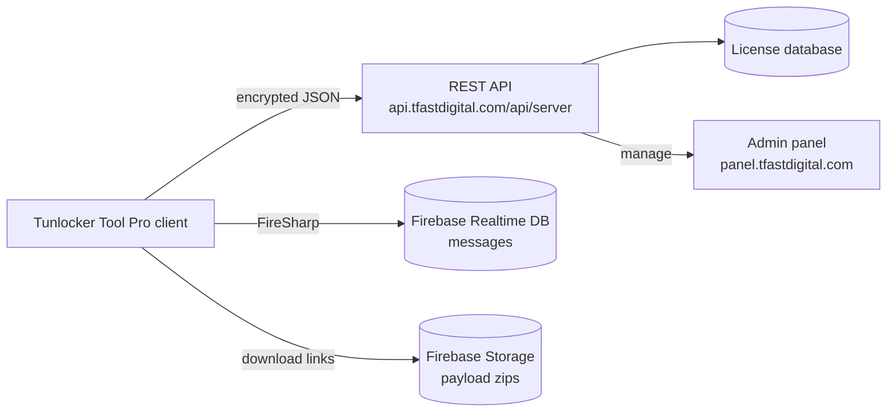

# Tunlocker Tool Pro backend and API

This document covers the server side of Tunlocker Tool Pro: the REST API, the request encryption, the Firebase services, the data models, and how to run your own backend.

## 1. Architecture



| Component | URL | In code |
| --- | --- | --- |
| REST API | https://api.tfastdigital.com/api/server | Api_Core.cs, serverhost |
| Firebase RTDB (messages) | https://data-unlock-api-messgas-default-rtdb.firebaseio.com/ | ClassDevronix.cs |
| Firebase RTDB (legacy) | https://motounlock-7d7d0-default-rtdb.firebaseio.com/ | motoulocked/encr.cs, Api00 |
| Firebase Storage (payloads) | motounlock-7d7d0.appspot.com | Form1.cs, SPDR.cs, TEST.cs |
| Admin panel | https://panel.tfastdigital.com/OperationTools/Index | Form1.cs |

## 2. The API layer

All server calls go through one method, Api_Core.TryRequestAsync(link, json), in motoulocked/Api_Core.cs:

```csharp
public static string serverhost = "https://api.tfastdigital.com/api/server";

string result = await Api_Core.TryRequestAsync("loginapi/", clss);
```

### Request encryption

What goes over the wire is a 3-layer encrypted blob:

1. The plain payload (the apilogin JSON, for example) is encrypted with encryptor.ENC().
2. It is wrapped as ggfnew { dataapi, Forward } and encrypted with the static key from tmpcrpt.keyQTx().
3. A per-request nonce num = DateTime.Now.Ticks is generated. key = MD5(num).
4. The result is encrypted again with key and wrapped in tokdata { data }.
5. The final JSON is POSTed to {serverhost}/{SymbolEnc.EncryptText(MD5(ticks))} with Content-Type: application/json.

The server decrypts in reverse, handles the request, encrypts the reply with the same key and returns tokdata { data }.

All crypto classes (tmpcrpt, SymbolEnc, encryptor, tokdata, ggfnew) are in this repository, so a compatible server can reuse them directly.

### Endpoints

| Forward | Purpose | Request model | Response model | File |
| --- | --- | --- | --- | --- |
| loginapi/ | login and license check | apilogin | apiloginreturn | Login.cs |
| Balancepdate/ | credit balance update | Balancepdateclass | | Balancepdate.cs |
| ban/ | ban a user | banclass | | banuser.cs |
| svcrtfile/ | save certificate file | CertFileSaveSet | | Cert.cs |
| getcrtfile/ | fetch certificate file | CertFileSaveGet | CertFileSaveGetFile | Cert.cs |
| info2/, info1val2/, infovar2/ | device info reporting | GetInfoSend | | getinfo.cs |
| Optionapi/ | submit logs | OperationToolapi | | Send_Log.cs |

## 3. Data models

### apilogin (login request)

| Field | Type | Meaning |
| --- | --- | --- |
| Email | string | username or email |
| Pass | string | password |
| Hwid | string | hardware ID of the PC |
| Loginby | string | client environment (SevaClass.Environmentuser) |
| Verizon, Osverizon | string | version info |
| tok | string | session token |
| City, Country | string | geo info |
| CMH | string | extra fingerprint |

Example:

```json
{
  "Email": "user@example.com",
  "Pass": "secret",
  "Hwid": "ABCD-1234",
  "Loginby": "Tunlocker Tool Pro",
  "Verizon": "2.0.0",
  "Osverizon": "Windows 11",
  "tok": "",
  "City": "Kampala",
  "Country": "UG",
  "CMH": ""
}
```

### apiloginreturn (login response)

| Field | Type | Meaning |
| --- | --- | --- |
| Blocked | bool | is the account banned |
| Types | string | license type, CREDIT LICENSE or annual |
| StartDate, EndTime | DateTime | license validity window |
| Credit | decimal | remaining credits |
| Hwid | string | registered hardware ID |
| Name | string | user's full name |
| Activate | bool | is the account activated |
| token | string | session token |
| username, email | string | account identifiers |
| Restricted_modle | string | models the license may not use |
| Restricted_func | string | functions the license may not use |
| tok2 | string | must equal num + 10 (anti-tamper check) |

Example:

```json
{
  "Blocked": false,
  "Types": "CREDIT LICENSE",
  "StartDate": "2026-01-01T00:00:00",
  "EndTime": "2026-12-31T00:00:00",
  "Credit": 50.0,
  "Hwid": "ABCD-1234",
  "Name": "John Doe",
  "Activate": true,
  "token": "session-token",
  "username": "user@example.com",
  "email": "user@example.com",
  "Restricted_modle": "",
  "Restricted_func": "",
  "tok2": "638705916000000010"
}
```

## 4. The login handshake (loginapi/)

1. Client generates num = DateTime.Now.Ticks.
2. Client POSTs the encrypted apilogin payload.
3. Server checks the credentials against its database.
4. Server builds an apiloginreturn where tok2 = num + 10.
5. Server encrypts it with MD5(num + 10) as the key and wraps it in tokdata.
6. Client decrypts with Api_Core.CalculateMD5Hash((num + 10).ToString()) and checks long.Parse(tok2) == num + 10. If not, it shows "Request Manipulation Detected Error Code : 525002" and exits.

The server can also return these plain strings inside the payload. The client checks for them in Login.cs:

| Server message | Client behavior |
| --- | --- |
| The password is invalid | "> Error In Password Data" |
| This Account Is Not Activation | "> This Account Is Not Activation" |
| is Locked | "> This Account Is Locked In Another PC" |
| undergoing maintenance | "> The Tool In Maintenance. Please Wait For A Moment And Try Again" |
| Blocked | ban flow, app exits |
| New update is available | update prompt (toolparam.uptool) |

After a successful login the session state lives in SevaClass (credits, StatusAcouunt, Token, Restricted_modle, Restricted_func). Operations check the balance there before running.

## 5. Firebase services

### Realtime Database (messages)

- Primary URL: https://data-unlock-api-messgas-default-rtdb.firebaseio.com/ (ClassDevronix.cs)
- Legacy URL: https://motounlock-7d7d0-default-rtdb.firebaseio.com/ (motoulocked/encr.cs, Api00)
- Get_Messgas.cs fetches the messages and announcements shown in the tool.

### Storage (payload downloads)

- Bucket: motounlock-7d7d0.appspot.com
- The tool downloads operation payloads (modem and root files, SPD firehose payloads) using signed ?alt=media&token=... URLs hardcoded in Form1.cs, SPDR.cs and TEST.cs.

### Setting up your own Firebase project

1. Go to console.firebase.google.com and create a project.
2. Enable Realtime Database (Build, Realtime Database).
3. Enable Storage.
4. Replace the URLs in the code:

| Swap in file | Old value | New value |
| --- | --- | --- |
| ClassDevronix.cs | https://data-unlock-api-messgas-default-rtdb.firebaseio.com/ | https://YOUR-PROJECT-default-rtdb.firebaseio.com/ |
| motoulocked/encr.cs | https://motounlock-7d7d0-default-rtdb.firebaseio.com/ | your RTDB URL |
| Form1.cs, SPDR.cs, TEST.cs | motounlock-7d7d0.appspot.com links | your bucket's public URLs |

5. For testing, set the database rules to read/write: true. Tighten them before anything public.

## 6. Running your own backend

### Option A: simplified, no encryption

Patch the client to plain JSON and any web framework will work.

1. In Api_Core.cs, change serverhost:

```csharp
public static string serverhost = "http://localhost:5000/api";
```

2. Replace the body of TryRequestAsync with a plain POST:

```csharp
public static async Task<string> TryRequestAsync(string link, string clss)
{
    using HttpClient val = new HttpClient();
    HttpRequestMessage msg = new HttpRequestMessage(HttpMethod.Post, serverhost + "/" + link);
    msg.Content = new StringContent(clss, Encoding.UTF8, "application/json");
    HttpResponseMessage res = await val.SendAsync(msg);
    return res.IsSuccessStatusCode ? await res.Content.ReadAsStringAsync() : "ERROR: " + res.StatusCode;
}
```

3. Minimal Node/Express server implementing loginapi/:

```js
const express = require('express');
const app = express();
app.use(express.json());

const USERS = { "demo@example.com": { pass: "demo123", credit: 50, name: "Demo User" } };

app.post('/api/loginapi/', (req, res) => {
  const { Email, Pass } = req.body;
  const u = USERS[Email];
  if (!u) return res.send("The password is invalid");
  if (u.pass !== Pass) return res.send("The password is invalid");

  const num = Date.now();
  res.json({
    data: JSON.stringify({
      Blocked: false, Types: "CREDIT LICENSE",
      StartDate: new Date().toISOString(), EndTime: new Date(Date.now() + 365 * 864e5).toISOString(),
      Credit: u.credit, Hwid: "", Name: u.name, Activate: true,
      token: "demo-token", username: Email, email: Email,
      Restricted_modle: "", Restricted_func: "",
      tok2: String(num + 10)
    })
  });
});

app.listen(5000, () => console.log('Tunlocker Tool Pro API on :5000'));
```

The simplified client still expects the tokdata.data wrapper and the tok2 == num + 10 check. Mirror the example exactly, or remove that check from Login.cs as well.

### Option B: full compatibility, reuse the repo crypto

Implement the server in C# and reference the same crypto classes that ship in this repository (tmpcrpt, SymbolEnc, encryptor, tokdata, ggfnew). The wire format then matches the stock client.

1. Read data = tokdata.data from the request body.
2. Decrypt data with MD5(ticks). Reconstruct the key the same way the client does (see Api_Core.TryRequestAsync).
3. Decrypt the inner payload with tmpcrpt.keyQTx().
4. Deserialize ggfnew, route on Forward, handle the plain JSON.
5. Encrypt the response in reverse and return tokdata { data }.

Note: tmpcrpt.keyQTx() is a static key embedded in the client. Treat the encryption as obfuscation, not security. Terminate TLS at your server and add your own auth.

## 7. Balance and credits

- License types: CREDIT LICENSE (pay per operation) or annual (unlimited between StartDate and EndTime).
- Balancepdate/ reports used credits back to the server (Balancepdate.cs).
- ban/ lets the server kill a session remotely (banuser.cs). On Blocked the client exits immediately.
- Session state (credits, StatusAcouunt, Token) lives in SevaClass.cs. Search for SevaClass. in Form1.cs to see how operations check the balance.

## 8. Security notes

| Issue | Recommendation |
| --- | --- |
| Static crypto key in client | treat envelope as obfuscation, enforce auth and limits server side |
| Plain credential model | hash stored passwords (bcrypt/scrypt), rate limit loginapi/ |
| Firebase open rules | restrict write rules, keep reads minimal |
| No code signing | sign releases |
| HWID binding | keep Hwid checks server side to prevent account sharing |

## 9. Code map

| File | Role |
| --- | --- |
| motoulocked/Api_Core.cs | serverhost, TryRequestAsync encrypted transport |
| motoulocked/Login.cs | login flow, handshake verification, session setup |
| motoulocked/core/apilogin.cs | login request model |
| motoulocked/core/apiloginreturn.cs | login response model |
| motoulocked/core/tokdata.cs, tokdata2.cs | envelope models |
| motoulocked/core/ggfnew.cs | inner wrapper (dataapi + Forward) |
| motoulocked/SevaClass.cs | global session state (credits, token, restrictions) |
| motoulocked/Balancepdate.cs | credit usage reporting |
| motoulocked/banuser.cs | remote ban handling |
| motoulocked/Cert.cs | certificate file save/fetch |
| motoulocked/getinfo.cs | device info reporting |
| motoulocked/Send_Log.cs | log submission |
| motoulocked/ClassDevronix.cs, motoulocked/encr.cs | Firebase RTDB URLs |
| motoulocked/Get_Messgas.cs | message/announcement fetch |
| Res/FireSharp.dll | Firebase client library |

