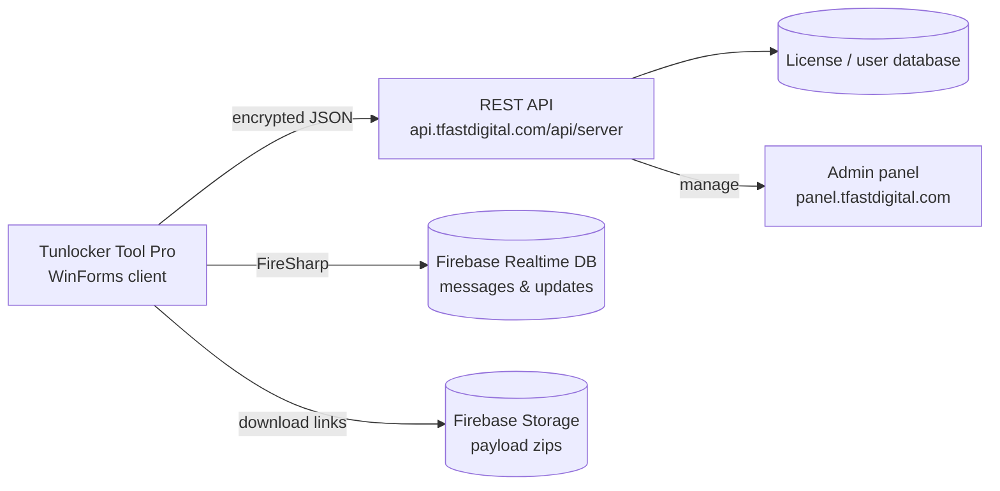

# Tunlocker Tool Pro — Backend & API Guide

Everything you need to understand, self-host, or recreate the server side of **Tunlocker Tool Pro**: the encrypted API protocol, the Firebase services, the data models, and a step-by-step recipe for running your own backend.

---

## 1. Architecture Overview



| Component | URL | Where in code |
| --- | --- | --- |
| REST API (main) | `https://api.tfastdigital.com/api/server` | `Api_Core.cs` → `serverhost` |
| Firebase RTDB (messages) | `https://data-unlock-api-messgas-default-rtdb.firebaseio.com/` | `ClassDevronix.cs` |
| Firebase RTDB (legacy) | `https://motounlock-7d7d0-default-rtdb.firebaseio.com/` | `motoulocked/encr.cs` → `Api00` |
| Firebase Storage (payloads) | `motounlock-7d7d0.appspot.com` | `Form1.cs`, `SPDR.cs`, `TEST.cs` |
| Admin panel | `https://panel.tfastdigital.com/OperationTools/Index` | `Form1.cs` (opened from the UI) |

---

## 2. The API Layer

All server calls go through one method — `Api_Core.TryRequestAsync(link, json)` in `motoulocked/Api_Core.cs`:

```csharp
public static string serverhost = "https://api.tfastdigital.com/api/server";

string result = await Api_Core.TryRequestAsync("loginapi/", clss);
```

### The encrypted request envelope

What actually goes over the wire is a 3-layer encrypted blob:

1. The plain payload (e.g. the `apilogin` JSON) is encrypted with `encryptor.ENC(...)`.
2. It is wrapped as `ggfnew { dataapi, Forward }` and encrypted with the static key from `tmpcrpt.keyQTx()`.
3. A per-request nonce `num = DateTime.Now.Ticks` is generated; `key = MD5(num)`.
4. The result is encrypted again with `key` and wrapped in `tokdata { data }`.
5. The final JSON is POSTed to `{serverhost}/{SymbolEnc.EncryptText(MD5(ticks))}` with `Content-Type: application/json`.

The server decrypts in reverse, processes the request, encrypts the reply with the same `key`, and returns `tokdata { data }`.

> 📌 All crypto classes (`tmpcrpt`, `SymbolEnc`, `encryptor`, `tokdata`, `ggfnew`) ship **in this repository** — a compatible server can reuse them directly.

### Endpoint reference

| Forward value | Purpose | Request model | Response model | File |
| --- | --- | --- | --- | --- |
| `loginapi/` | Login / license check | `apilogin` | `apiloginreturn` | `Login.cs` |
| `Balancepdate/` | Credit balance update | `Balancepdateclass` | — | `Balancepdate.cs` |
| `ban/` | Ban a user | `banclass` | — | `banuser.cs` |
| `svcrtfile/` | Save certificate file | `CertFileSaveSet` | — | `Cert.cs` |
| `getcrtfile/` | Fetch certificate file | `CertFileSaveGet` | `CertFileSaveGetFile` | `Cert.cs` |
| `info2/`, `info1val2/`, `infovar2/` | Device info reporting | `GetInfoSend` | — | `getinfo.cs` |
| `Optionapi/` | Submit logs | `OperationToolapi` | — | `Send_Log.cs` |

---

## 3. Data Models

### `apilogin` — request (login)

| Field | Type | Meaning |
| --- | --- | --- |
| `Email` | string | Username / email |
| `Pass` | string | Password |
| `Hwid` | string | Hardware ID of the PC |
| `Loginby` | string | Client environment (`SevaClass.Environmentuser`) |
| `Verizon`, `Osverizon` | string | Version info |
| `tok` | string | Session token |
| `City`, `Country` | string | Geo info |
| `CMH` | string | Extra fingerprint |

Example:

```json
{
  "Email": "user@example.com",
  "Pass": "secret",
  "Hwid": "ABCD-1234",
  "Loginby": "Tunlocker Tool Pro",
  "Verizon": "2.0.0",
  "Osverizon": "Windows 11",
  "tok": "",
  "City": "Kampala",
  "Country": "UG",
  "CMH": ""
}
```

### `apiloginreturn` — response (login)

| Field | Type | Meaning |
| --- | --- | --- |
| `Blocked` | bool | Account banned? |
| `Types` | string | License type — `"CREDIT LICENSE"` or annual |
| `StartDate`, `EndTime` | DateTime | License validity window |
| `Credit` | decimal | Remaining credits |
| `Hwid` | string | Registered hardware ID |
| `Name` | string | User's full name |
| `Activate` | bool | Is the account activated? |
| `token` | string | Session token |
| `username`, `email` | string | Account identifiers |
| `Restricted_modle` | string | Models the license may NOT use |
| `Restricted_func` | string | Functions the license may NOT use |
| `tok2` | string | **Must equal `num + 10`** (anti-tamper check) |

Example:

```json
{
  "Blocked": false,
  "Types": "CREDIT LICENSE",
  "StartDate": "2026-01-01T00:00:00",
  "EndTime": "2026-12-31T00:00:00",
  "Credit": 50.0,
  "Hwid": "ABCD-1234",
  "Name": "John Doe",
  "Activate": true,
  "token": "session-token",
  "username": "user@example.com",
  "email": "user@example.com",
  "Restricted_modle": "",
  "Restricted_func": "",
  "tok2": "638705916000000010"
}
```

---

## 4. The Login Handshake (`loginapi/`)

1. Client generates `num = DateTime.Now.Ticks`.
2. Client POSTs the encrypted `apilogin` payload.
3. Server validates credentials against its database.
4. Server builds an `apiloginreturn` where **`tok2 = num + 10`**.
5. Server encrypts it with `MD5(num + 10)` as the key and wraps it in `tokdata`.
6. Client decrypts with `Api_Core.CalculateMD5Hash((num + 10).ToString())` and verifies `long.Parse(tok2) == num + 10`. On mismatch it shows *"Request Manipulation Detected Error Code : 525002"* and exits.

The server can also return these plain-text signals (checked client-side in `Login.cs`):

| Server message (inside payload) | Client behavior |
| --- | --- |
| `The password is invalid` | *"> Error In Password Data"* |
| `This Account Is Not Activation` | *"> This Account Is Not Activation"* |
| `is Locked` | *"> This Account Is Locked In Another PC"* |
| `undergoing maintenance` | *"> The Tool In Maintenance…"* |
| `Blocked` | Ban flow → app exits |
| `New update is available` | Update prompt (`toolparam.uptool`) |

After a successful login the session state lives in `SevaClass` (`credits`, `StatusAcouunt`, `Token`, `Restricted_modle/func`, …).

---

## 5. Firebase Services

### Realtime Database (messages / announcements)

- Primary URL: `https://data-unlock-api-messgas-default-rtdb.firebaseio.com/` (`ClassDevronix.cs`)
- Legacy URL: `https://motounlock-7d7d0-default-rtdb.firebaseio.com/` (`motoulocked/encr.cs`, `Api00`)
- Used by `Get_Messgas.cs` to fetch messages/announcements shown in the tool.

### Storage (payload downloads)

- Bucket: `motounlock-7d7d0.appspot.com`
- The tool downloads operation payloads (modem/root files, SPD firehose payloads) with signed `?alt=media&token=...` URLs hardcoded in `Form1.cs`, `SPDR.cs`, and `TEST.cs`.

### Creating your own Firebase project

1. Go to [console.firebase.google.com](https://console.firebase.google.com/) → **Add project**.
2. **Build → Realtime Database** → Create database (choose any region).
3. **Build → Storage** → Get started.
4. Replace the URLs in the code:

| Swap in file | Old value | New value |
| --- | --- | --- |
| `ClassDevronix.cs` | `https://data-unlock-api-messgas-default-rtdb.firebaseio.com/` | `https://YOUR-PROJECT-default-rtdb.firebaseio.com/` |
| `motoulocked/encr.cs` | `https://motounlock-7d7d0-default-rtdb.firebaseio.com/` | your RTDB URL |
| `Form1.cs`, `SPDR.cs`, `TEST.cs` | `motounlock-7d7d0.appspot.com` links | your bucket's public URLs |

5. Set database rules wide-open for testing (`read/write: true`) — **tighten before any public release**.

---

## 6. Self-Hosting Your Own Backend

### Option A — Simplified (no encryption, fastest)

Patch the client to plain JSON so any web framework works:

1. In `Api_Core.cs`, replace `serverhost`:

```csharp
public static string serverhost = "http://localhost:5000/api";
```

2. Replace the body of `TryRequestAsync` with a plain POST:

```csharp
public static async Task<string> TryRequestAsync(string link, string clss)
{
    using HttpClient val = new HttpClient();
    HttpRequestMessage msg = new HttpRequestMessage(HttpMethod.Post, serverhost + "/" + link);
    msg.Content = new StringContent(clss, Encoding.UTF8, "application/json");
    HttpResponseMessage res = await val.SendAsync(msg);
    return res.IsSuccessStatusCode ? await res.Content.ReadAsStringAsync() : "ERROR: " + res.StatusCode;
}
```

3. Minimal server (Node/Express) implementing `loginapi/`:

```js
const express = require('express');
const app = express();
app.use(express.json());

const USERS = { "demo@example.com": { pass: "demo123", credit: 50, name: "Demo User" } };

app.post('/api/loginapi/', (req, res) => {
  const { Email, Pass } = req.body;
  const u = USERS[Email];
  if (!u) return res.send("The password is invalid");
  if (u.pass !== Pass) return res.send("The password is invalid");

  const num = Date.now();                       // ticks-nonce (millis here)
  res.json({
    data: JSON.stringify({                      // client expects tokdata.data = apiloginreturn JSON
      Blocked: false, Types: "CREDIT LICENSE",
      StartDate: new Date().toISOString(), EndTime: new Date(Date.now() + 365 * 864e5).toISOString(),
      Credit: u.credit, Hwid: "", Name: u.name, Activate: true,
      token: "demo-token", username: Email, email: Email,
      Restricted_modle: "", Restricted_func: "",
      tok2: String(num + 10)                    // anti-tamper nonce
    })
  });
});

app.listen(5000, () => console.log('Tunlocker Tool Pro API on :5000'));
```

> ⚠️ The simplified client still expects the `tokdata.data` wrapper and the `tok2 == num + 10` check — mirror the example exactly, or strip the check from `Login.cs` too.

### Option B — Full-compatible (reuse the repo crypto)

Implement the server in C# and reference the same crypto classes that ship in this repository (`tmpcrpt`, `SymbolEnc`, `encryptor`, `tokdata`, `ggfnew`). The wire format is then byte-compatible with the stock client:

1. Read `data = tokdata.data` from the request body.
2. Decrypt `data` with `MD5(ticks)` (reconstruct the key the same way the client does — see `Api_Core.TryRequestAsync`).
3. Decrypt the inner payload with `tmpcrpt.keyQTx()`.
4. Deserialize `ggfnew` → route on `Forward` → handle the plain JSON.
5. Encrypt the response in reverse and return `tokdata { data }`.

> 🔑 **Key note:** `tmpcrpt.keyQTx()` is a static key embedded in the client — treat the encryption as **obfuscation, not security**. Always terminate TLS at your server and add your own auth layer.

---

## 7. Balance & Credit System

- License types: `"CREDIT LICENSE"` (pay-per-operation credits) or **Annual** (unlimited within `StartDate`→`EndTime`).
- `Balancepdate/` reports used credits back to the server (`Balancepdate.cs`).
- `ban/` lets the server kill a session remotely (`banuser.cs`) — on `Blocked` the client exits immediately.
- The session state (`credits`, `StatusAcouunt`, `Token`) lives in `SevaClass.cs` — search for `SevaClass.` in `Form1.cs` to see how operations check the balance before running.

---

## 8. Security Notes

| Issue | Recommendation |
| --- | --- |
| Static crypto key in client | Treat envelope as obfuscation; enforce auth/limits server-side |
| Plain-credential model | Use bcrypt/scrypt for stored passwords; rate-limit `loginapi/` |
| Firebase open rules | Restrict write rules; keep reads minimal |
| No code signing | Sign releases (see `Packaging & Releases` in the README) |
| HWID binding | Keep `Hwid` checks server-side to prevent account sharing |

---

## 9. Code Map

| File | Role |
| --- | --- |
| `motoulocked/Api_Core.cs` | `serverhost`, `TryRequestAsync` encrypted transport |
| `motoulocked/Login.cs` | Login flow, handshake verification, session setup |
| `motoulocked/core/apilogin.cs` | Login request model |
| `motoulocked/core/apiloginreturn.cs` | Login response model |
| `motoulocked/core/tokdata.cs`, `tokdata2.cs` | Envelope models |
| `motoulocked/core/ggfnew.cs` | Inner wrapper (`dataapi` + `Forward`) |
| `motoulocked/SevaClass.cs` | Global session state (credits, token, restrictions) |
| `motoulocked/Balancepdate.cs` | Credit usage reporting |
| `motoulocked/banuser.cs` | Remote ban handling |
| `motoulocked/Cert.cs` | Certificate file save/fetch |
| `motoulocked/getinfo.cs` | Device info reporting |
| `motoulocked/Send_Log.cs` | Log submission |
| `motoulocked/ClassDevronix.cs`, `motoulocked/encr.cs` | Firebase RTDB URLs |
| `motoulocked/Get_Messgas.cs` | Message/announcement fetch |
| `Res/FireSharp.dll` | Firebase client library |
