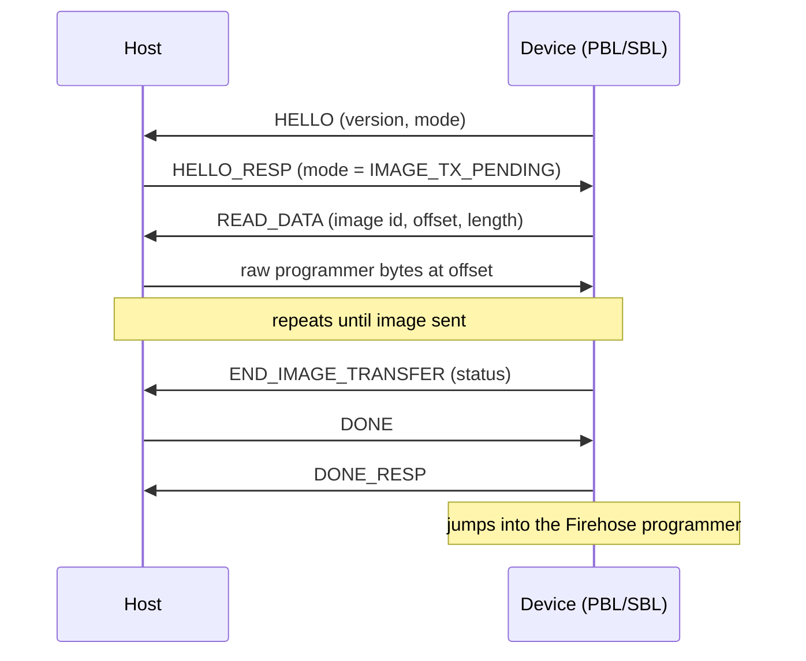
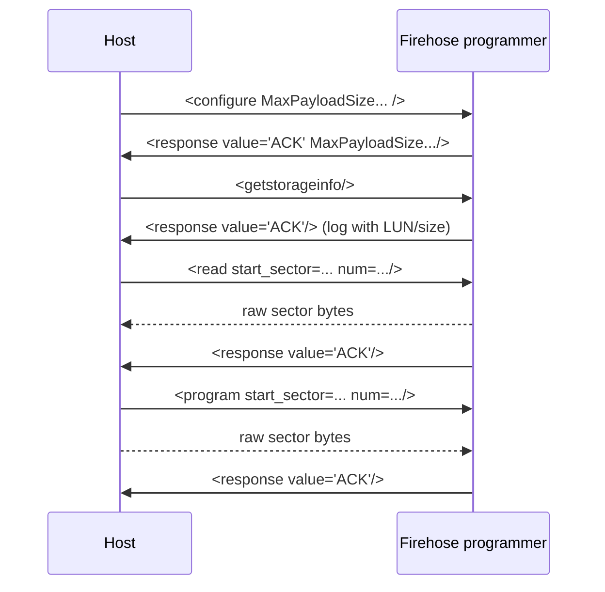
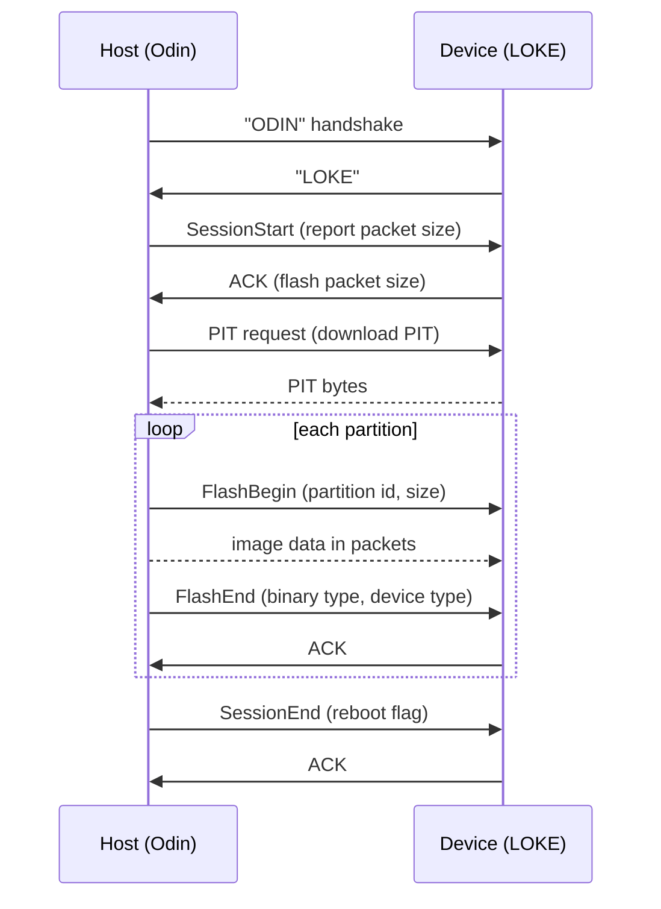
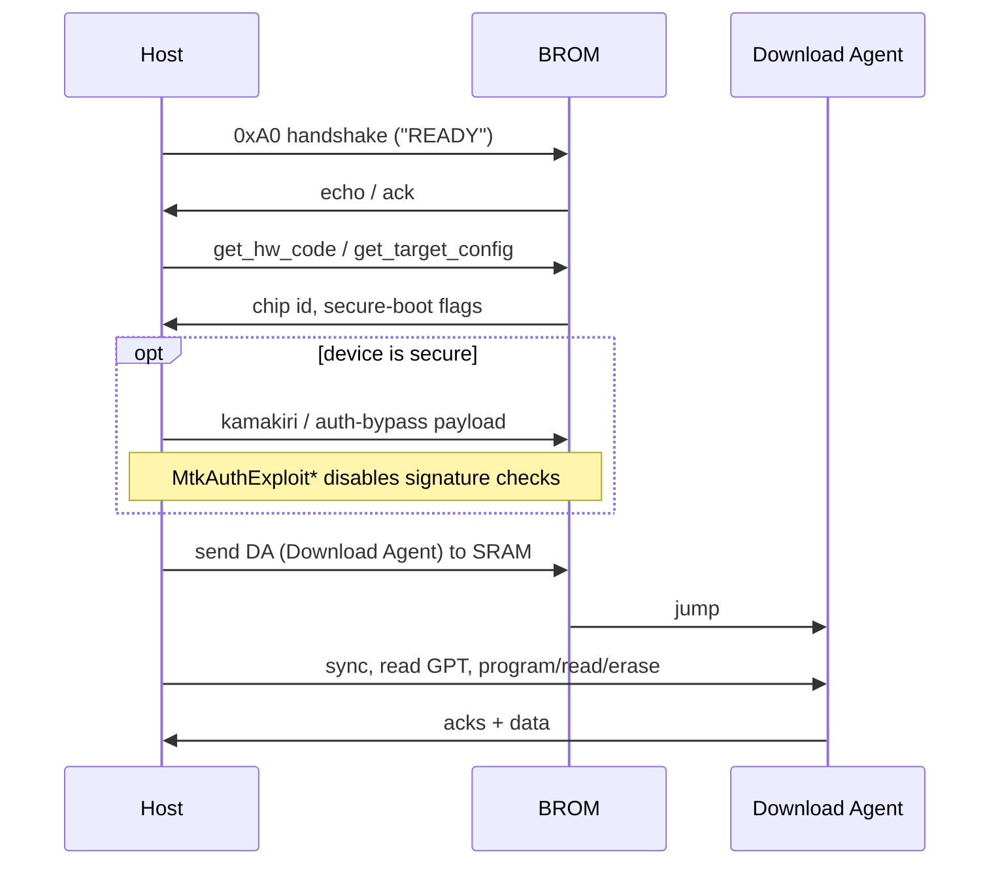
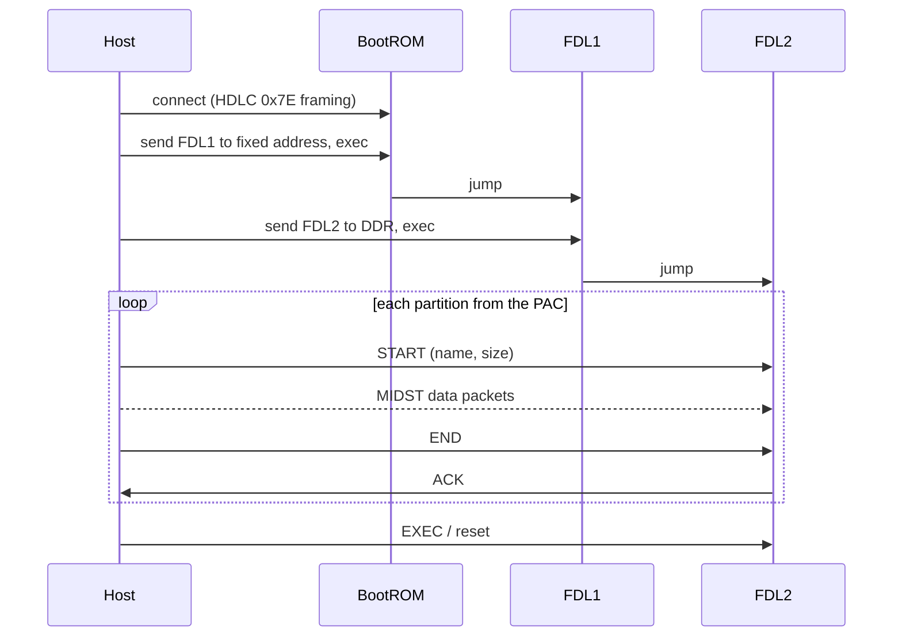

# Protocols

The wire protocols Tunlocker Tool Pro speaks to each chipset family. One level deeper than [FEATURES.md](FEATURES.md): state machines, packet shapes, and the exact command names, mapped to the files that implement them. The data structures these protocols carry (GPT, PIT, PAC, scatter, sparse) are documented in [FILE_FORMATS.md](FILE_FORMATS.md). Acronyms in [GLOSSARY.md](GLOSSARY.md).

All of these run over a USB serial / bulk endpoint after the device is put into a special download mode. Detection and port enumeration is in `COMPortInfoB.cs`; the raw serial layer is `motoulocked/SerialCOM.cs` and `PortIOMe.cs`.

---

## 1. Qualcomm — Sahara then Firehose (EDL)

Entry mode: **EDL** (Emergency Download, USB PID `9008`). Reached by a hardware test point, an `adb reboot edl`, or a crash. Two protocols run back to back: Sahara loads a programmer, then that programmer speaks Firehose.

Code: `motoulocked/SAHARA.cs`, `SAHARA_MANAGER.cs`, and the `FIREHOSE_*.cs` family (`FIREHOSE.cs`, `FIREHOSE_MANAGER.cs`, `FIREHOSE_OPERATIONS.cs`, `FIREHOSE_GPT.cs`, `FIREHOSE_PARTITIONS.cs`, `FIREHOSE_PACKET.cs`, `FIREHOSE_RESPONSE.cs`).

### Sahara handshake

Sahara is a small binary protocol whose only job is to hand a signed *programmer* (the Firehose loader, aka `prog_firehose_ddr.elf`) to the device's boot ROM.

Sahara also has a **command mode** (`SAHARA_MODE_COMMAND`) used for info reads before loading anything. From the `SAHARA_EXEC_CMD` enum in `SAHARA.cs`:

| Cmd | Value | Reads |
| --- | --- | --- |
| NOP | 0 | nothing (ping) |
| SERIAL_NUM_READ | 1 | device serial |
| MSM_HW_ID_READ | 2 | SoC hardware ID |
| OEM_PK_HASH_READ | 3 | the OEM public-key hash (tells you which signed loader the device will accept) |
| SWITCH_TO_DMSS_DLOAD | 4 | fall back to old DMSS download |
| SWITCH_TO_STREAM_DLOAD | 5 | streaming download |
| READ_DEBUG_DATA | 6 | debug blob |
| GET_SOFTWARE_VERSION_SBL | 7 | SBL version |

Reading the HW ID and PK hash first is what lets a tool pick the right loader per device.

### Firehose

Once the programmer is running, everything is **XML over the bulk endpoint**, with raw partition bytes in between. Verbs actually emitted by `FIREHOSE.cs`:

| Verb | Purpose |
| --- | --- |
| `<configure>` | negotiate `MaxPayloadSizeToTargetInBytes`, storage type (`UFS`/`eMMC`), sector size |
| `<nop>` | ping / keep-alive |
| `<getstorageinfo>` | LUN count, total sectors |
| `<read>` | read `num_partition_sectors` from `start_sector` on a LUN, device then streams raw bytes |
| `<program>` | announce a write; host then sends raw bytes for the given sectors |
| `<erase>` | zero/erase a sector range |
| `<patch>` | in-place edit of a few bytes (used to fix GPT, set `unlock` flags) |
| `<setbootablestoragedrive>` | choose the LUN that boots |
| `<peek>` / `<poke>` | read/write device memory |
| `<power>` | reset / power off |

A read of the `userdata` GPT range plus a couple of `<patch>` calls is the shape of many "FRP" and "unlock" operations. Every response comes back as an XML `<response value="ACK"/>` or `NAK`, parsed in `FIREHOSE_RESPONSE.cs`.

---

## 2. Samsung — Odin / LOKE

Entry mode: **Download mode** (Vol-Down + power + USB, or `adb reboot download`). The protocol is called LOKE on the device side; the PC side is Odin.

Code: `motoulocked/OdinClient/`. Command model: `OdinClient/structs/SamsungLokeCommand.cs`. PIT handling: `OdinClient/Pit/` (see [FILE_FORMATS.md](FILE_FORMATS.md) §2). Result struct: `structs/ReadPitResult.cs`.

Odin is a sequence of small control packets, each acknowledged, framed around a handshake and a per-partition transfer.

The fields carried in each control packet map directly to `SamsungLokeCommand`: `Cmd`, `SeqCmd`, `BinaryType` (AP vs CP), `SizeWritten`, `DeviceId`, `Identifier` (which PIT entry), `SessionEnd`, `EfsClear`, `BootUpdate`. The device uses the PIT (downloaded first) to know where each `Identifier` writes.

---

## 3. MediaTek — BROM → Preloader → DA

Entry modes: **BROM** (boot ROM, reached with a boot key or test point, before anything else runs) and **Preloader** (the first-stage bootloader). Both hand off to a **DA** (Download Agent) that the host uploads and that then does the real partition work.

Code: `mtkclient2/` (a C# port of Python mtkclient) and the legacy `Protocol_MTK_By_Devronix.cs`. Handshake: `library/xflash/MtkHandshakeService.cs`, `MtkPreloaderService.cs`. DA upload: `MtkDaService.cs`, `MtkDaWriteService.cs`. Exploits: `library/xflash/MtkAuthExploit*.cs` (kamakiri etc.). Crypto: `MTK/Client/hwcrypto.cs`, `hwcrypto_sej.cs`. Seccfg: `MTK/Client/seccfg.cs`.

Once the DA is running:

- Partition map comes from GPT (`MtkGpt.cs`) or the scatter file ([FILE_FORMATS.md](FILE_FORMATS.md) §4).
- Images are streamed, expanding sparse chunks on the fly ([FILE_FORMATS.md](FILE_FORMATS.md) §5).
- "Unlock" writes a new `seccfg` block ([FILE_FORMATS.md](FILE_FORMATS.md) §6).

The `get_target_config` response is the fork in the road: if secure boot / SLA / DAA is on, the tool runs an `MtkAuthExploit*` payload before it is allowed to upload its own DA. That is the whole trick behind "auth bypass" on MediaTek.

---

## 4. Spreadtrum / Unisoc — ResearchDownload (SPD)

Entry mode: hold a boot key to reach the Unisoc **download mode**. The protocol is HDLC-framed with a small first-stage loader (FDL1) that then loads FDL2, which does partition work.

Code: `motoulocked/SPDR.cs`, `SPD/uni.cs`, `SPD/Worker/WorkerDownload.cs`. Firmware container: `SPD/PACExtractor.cs` (see [FILE_FORMATS.md](FILE_FORMATS.md) §3).

Packets are HDLC frames (`0x7E` delimiters, byte-stuffing, CRC). The two-stage FDL1→FDL2 load exists because the boot ROM can only place a tiny loader in SRAM; FDL2 is what actually reaches the flash.

---

## 5. Huawei / Honor — Kirin over DIAGNOS

Entry mode: Huawei's **DIAGNOS/COM 1.0** test mode on older Kirin devices.

Code: `motoulocked/kirin.cs`, `HuaweiUnlocker/DIAGNOS/Bootloader.cs`, `HuaweiUnlocker/TOOLS/` (`HISI.cs`, `Fastboot.cs`, `ImageFlasher.cs`). This path is narrower than the others — mostly FRP and bootloader operations on specific HiSilicon models — and leans on fastboot for the rest.

---

## 6. The common layer: ADB and fastboot

Not a chipset protocol, but the fallback path for anything that boots normally. The tool shells out to bundled `adb.exe` and `fastboot.exe`.

Code: `motoulocked/ProcessConnection.cs` (starts the processes, feeds commands, reads output), `AndroidCommands.cs`, `Android_Qualcomm.cs`.

- **ADB** (device booted to Android/recovery with debugging on): `adb devices`, `adb shell`, `adb pull`. Used to read state and, on some FRP flows, to trigger settings intents.
- **fastboot** (device in bootloader): `fastboot devices`, `fastboot flash <part> `, `fastboot erase <part>`, `fastboot oem ...`, `fastboot flashing unlock`.

Everything above (Sahara/Firehose/Odin/DA) is what you use when the device *won't* boot far enough to reach ADB or fastboot — a dead bootloader, a locked FRP, a bricked partition. That is the whole reason these low-level protocols exist.

---

## Protocol → file quick reference

| Family | Mode | Key files |
| --- | --- | --- |
| Qualcomm | EDL 9008 | `SAHARA.cs`, `FIREHOSE_*.cs`, `EDL.cs` |
| Samsung | Download / LOKE | `OdinClient/`, `SamsungLokeCommand.cs`, `Pit/` |
| MediaTek | BROM / Preloader / DA | `mtkclient2/`, `Protocol_MTK_By_Devronix.cs` |
| Unisoc | ResearchDownload | `SPDR.cs`, `SPD/`, `SPD/Worker/` |
| Huawei | DIAGNOS / Kirin | `kirin.cs`, `HuaweiUnlocker/` |
| Common | ADB / fastboot | `ProcessConnection.cs`, `AndroidCommands.cs` |
