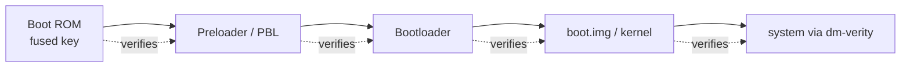

# Security concepts

The "why" behind the tool. To service a locked phone you have to understand the protections you are working around — and where those protections are legitimate barriers against theft. This doc explains the Android security model, why each lock exists, and where this codebase touches it. Terms are in [GLOSSARY.md](GLOSSARY.md); mechanics in [PROTOCOLS.md](PROTOCOLS.md) and [FILE_FORMATS.md](FILE_FORMATS.md).

Read the legal note in the [README](../README.md) first. These mechanisms exist to stop phone theft. Working around them is legitimate for repair on devices you own or are authorized to service, and illegal otherwise.

---

## 1. The verified boot chain

When a phone powers on, each stage cryptographically verifies the next before handing over control:

- The **boot ROM** holds a hardware key fused at the factory. It cannot be changed, which is why it is the root of trust — and why boot-ROM exploits (kamakiri) are so valuable: they undercut the root itself.
- Each later stage checks a signature against a key chained from that root. This is **Android Verified Boot (AVB)**.
- **dm-verity** extends the check to the read-only `system` partition: every block is hashed, so a modified system image fails at runtime.

Why it exists: it stops an attacker (or malware) from silently replacing the OS. It is genuinely good security. The cost to a repair tech is that you cannot just write arbitrary firmware to a locked device — hence the download-mode protocols and, on secured devices, the auth-bypass step.

---

## 2. Secure boot, SLA and DAA (why "auth bypass" is a step)

On a secured device the download entry point itself is gated:

- **Secure boot** — the SoC refuses to run a Download Agent that is not signed by the OEM.
- **MediaTek SLA / DAA** — Serial Link Authentication and Download Agent Authentication: challenge-response checks in the BROM that must pass before the host may upload its own DA.
- **Qualcomm signed loaders** — the Firehose programmer must be signed for that device's **OEM PK hash** (read over Sahara, [PROTOCOLS.md](PROTOCOLS.md) §1).

This is why the MediaTek flow has a fork: `get_target_config` reports whether SLA/DAA/secure-boot are on, and only then does the tool run a `MtkAuthExploit*` payload (kamakiri and friends) to disable the signature check so an unsigned DA can load. On Qualcomm, the equivalent is obtaining a loader that matches the device's PK hash. No bypass, no low-level access — the device simply will not talk.

Where in code: `mtkclient2/library/xflash/MtkAuthExploit*.cs`, `MtkBootloaderCrashService.cs`; Qualcomm PK hash read in `SAHARA.cs`.

---

## 3. Bootloader lock state (seccfg)

"Bootloader unlocked" is a single stored flag that AVB reads to decide how strict to be:

- **Locked** — only OEM-signed images boot. Factory state.
- **Unlocked** — user-signed or unsigned images boot; the device shows a warning at every start.

On MediaTek that flag lives in the **seccfg** block ([FILE_FORMATS.md](FILE_FORMATS.md) §6): `lock_state = 01` locked, `03` unlocked, built by `seccfg.cs`. On a real device the block is bound to the hardware via the **SEJ** crypto engine (`hwcrypto_sej.cs`), so you cannot just flip a byte — the preloader recomputes and checks the binding. That is why unlocking runs through the authenticated DA path rather than a raw partition write.

Unlocking is destructive by design: every legitimate unlock triggers a **data wipe**, so a thief cannot unlock to read a victim's data. Repair techs unlock a device they own; the wipe is expected.

---

## 4. Factory Reset Protection (FRP)

FRP is the anti-theft lock most of this tool's "unlock" operations deal with.

- When a Google account is on the device, its identity is recorded in the **FRP partition** (a small persistent partition, separate from userdata).
- After a factory reset — including a thief wiping a stolen phone — setup demands that *same* Google account before the phone is usable.
- The reset does **not** clear the FRP record; that is the whole point.

So "FRP removal" means clearing or bypassing that persistent record. Legitimately this happens when an owner forgets their own account, or a refurbisher processes devices with proof of ownership. On a stolen phone it defeats the exact protection FRP was built for — which is why the README's legal line matters and why reputable shops keep proof-of-ownership records.

Where in code: `FRP.cs`, `DownloadMFRP.cs`, and the per-chipset partition access in the protocol layers.

---

## 5. IMEI, EFS/NV and calibration data

The modem's identity and radio calibration live in protected partitions:

- **IMEI** — the 15-digit modem serial, in a modem/NV partition. Changing another device's IMEI onto yours is illegal in most countries; restoring a device's **own original** IMEI after an EFS corruption is the legitimate "IMEI repair" case.
- **EFS / NV** — hold IMEI, Bluetooth/Wi-Fi MACs, and RF calibration. Corrupting them bricks the radio, which is why the tool backs these up before touching them.
- **cert files** — per-device certificates used to re-sign modem data (`qcert3.cs`, `Cert.cs`).

Treat these as the highest-risk operations in the tool: a bad write here is often unrecoverable without a backup.

---

## 6. Where cryptography is real vs. obfuscation

Not all "encryption" in a system like this is a security boundary — knowing which is which prevents false confidence:

| Layer | Kind | Reality |
| --- | --- | --- |
| Device secure boot / AVB signatures | Real crypto | A genuine barrier; only bypassable via a real exploit |
| seccfg SEJ binding | Real crypto | Hardware-bound; can't be forged by editing bytes |
| Login request encryption (`encryptor.cs`, `AESS.cs`) | Obfuscation | Hides the request shape, not a security control — TLS is what actually protects it. See [BACKEND_GUIDE.md](BACKEND_GUIDE.md) |
| Client-side license checks | Trust boundary is the server | The client can be patched; entitlement must be enforced server-side |

The rule: a control that runs on hardware you don't own (the phone's SoC) is real; a control that runs on the technician's PC (the client's own checks) is only as strong as the server behind it.

---

## 7. Threat model summary

| Protection | Defends against | Legitimate service case | Abuse case |
| --- | --- | --- | --- |
| Verified boot / AVB | Malware replacing the OS | Reflashing your own device's firmware | Installing hostile firmware |
| Bootloader lock | Booting tampered images | Developer/owner unlock (with wipe) | Unlocking to strip a victim's data |
| FRP | Using a wiped stolen phone | Owner forgot their own account | Reactivating a stolen phone |
| IMEI protection | Cloning device identity | Restoring a device's original IMEI | Cloning/faking an IMEI |
| KYC/DRM on the tool | Unlicensed use of the tool | — | Piracy of the tool |

Everything this tool does sits on the left column for a repair shop and the right column for a thief. The code is the same; the authorization is what differs. That is exactly why the README requires device ownership or written authorization, and why a real service business keeps records.

---

## Further reading

- Android Verified Boot: https://source.android.com/docs/security/features/verifiedboot
- FRP: https://source.android.com/docs/security/features/frp
- dm-verity: https://source.android.com/docs/security/features/verifiedboot/dm-verity
- More references and papers in [RESOURCES.md](RESOURCES.md).
