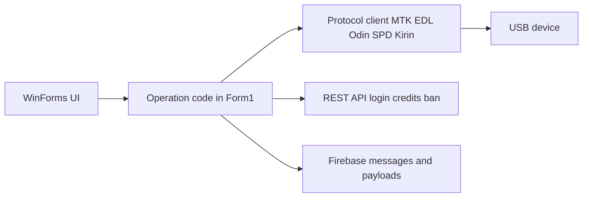

# How the tool works end to end

This walks through what happens when the tool runs, from double click to a finished operation. Each step names the code that handles it.

## 1. Startup

In motoulocked/Form1.cs:

1. The app drops its embedded binaries next to itself: adb.exe, AdbWinApi.dll, AdbWinUsbApi.dll and fastboot.exe (from Resources).
2. It creates a hidden mtk folder for MediaTek work files.
3. It kills leftover adb.exe processes from previous runs.
4. It loads settings from XML (LoadXML.cs, toolparam.cs).
5. It checks for updates against the server.
6. It shows the login screen (Login.cs). No connection means No_Internet.cs instead.

## 2. Login

Login.cs encrypts the credentials and posts them to loginapi/. The full protocol is in docs/BACKEND_GUIDE.md. On success the session state is stored in SevaClass: credits, license type, token, restricted models, restricted functions.

## 3. Device detection

- COMPortInfoB.cs lists COM ports.
- MediaTek: Protocol_MTK_By_Devronix.cs and mtkclient2/ handle preloader and BROM detection.
- Qualcomm: EDL.cs handles the Sahara and Firehose handshakes.
- Samsung: OdinClient/ speaks the Odin protocol.
- ADB and fastboot run through ProcessConnection.cs.

The tool reads device info (model, platform, IMEI) and reports it to the server through getinfo.cs (info2/, info1val2/, infovar2/).

## 4. Picking an operation

Operations are gated by the license:

- CREDIT LICENSE accounts spend credits per operation.
- Annual accounts can run anything allowed between StartDate and EndTime.
- Restricted_modle and Restricted_func block specific models or functions.

Balancepdate.cs reports credit usage back to the server. banuser.cs handles remote bans and the app exits when an account is Blocked.

## 5. Downloading payloads

Some operations need payload files: modem packages, root files, firehose loaders. They are downloaded from Firebase Storage using signed URLs hardcoded in Form1.cs, SPDR.cs and TEST.cs.

## 6. Running the operation

- MediaTek unlock or flash: mtkclient2 Tasks (MtkTask.InitAsync, Unlock_Code_1, Unlock_Code_2) run BROM and preloader commands over USB.
- Flashing: flash.cs parses scatter files and writes partitions. CRC32 checks come from Force/Crc32.
- FRP: FRP.cs reads and clears the FRP state for the detected chipset.
- IMEI and certificates: qcert3.cs builds certificates, Cert.cs saves and fetches them from the server (svcrtfile/, getcrtfile/).
- File extraction: Operations/Ext4 parses ext4 images read-only.

## 7. Logging

ModuleLogger.cs writes logs locally. Send_Log.cs submits them to the server (Optionapi/).

## Data flow

## Where to look next

- docs/BACKEND_GUIDE.md for the server side
- docs/LEARNING_PATH.md for a study plan
